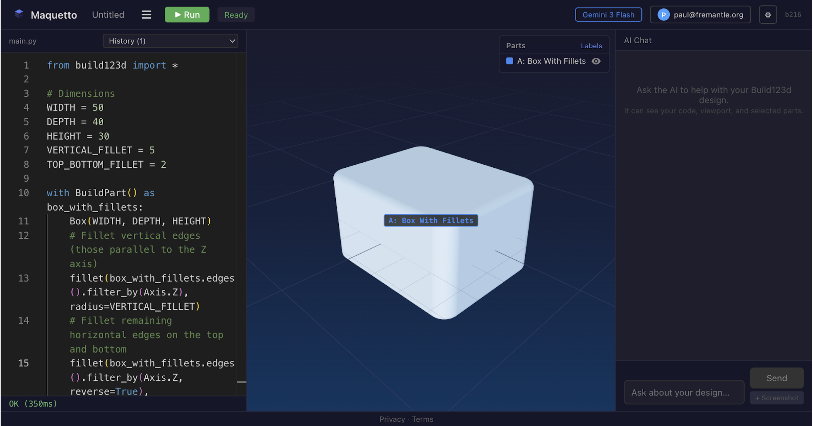

# Maquetto

**AI-powered CAD in your browser.** Write Python CAD code with [Build123d](https://github.com/gumyr/build123d), see real-time 3D previews, and use AI to modify designs through natural language — all without installing anything.



## What is Maquetto?

Maquetto is a browser-only CAD IDE that combines a Python code editor, a 3D viewport, and an AI assistant. The entire CAD pipeline — Python execution, OpenCASCADE geometry kernel, glTF export — runs client-side via WebAssembly.

- **Real Python** — numpy, classes, generators, full Build123d. Not a toy subset.
- **AI with spatial context** — The AI sees your code, viewport screenshot, part labels, and camera angle. It generates code, compiles it to verify, then applies it.
- **Multi-provider AI** — Google Gemini (OAuth or BYOK), Anthropic Claude (BYOK). Add a provider by installing one npm package.
- **Progressive UX** — Editor and chat load in under 1 second. The CAD engine loads in the background. A service worker caches all WASM for fast revisits.
- **Cloud save** — Sign in with Google to save projects to the cloud (Supabase + RLS).

## Quick Start

```bash
# Prerequisites: Node 22+, pnpm 9+
pnpm install
pnpm dev
```

Open [http://localhost:5173](http://localhost:5173). The CAD engine will take ~30s to load on first visit (WASM downloads are cached after that).

### Environment Variables

Create a `.env` file in `packages/frontend/`:

```env
# Required for cloud save + Google OAuth sign-in
VITE_SUPABASE_URL=your-supabase-url
VITE_SUPABASE_ANON_KEY=your-supabase-anon-key

# Required for Google OAuth (Gemini API access)
VITE_GOOGLE_CLIENT_ID=your-google-client-id
```

AI providers can also be configured with BYOK (Bring Your Own Key) directly in the app — no environment variables needed.

## Architecture

```
┌─────────────────────────────────────────────────┐
│  UI Layer (React + TypeScript)                  │
│  Editor │ Viewport │ Chat │ Toolbar             │
└─────────────┬───────────────────┬───────────────┘
              │                   │
    ┌─────────▼─────────┐  ┌─────▼──────────────┐
    │  CAD Engine        │  │  AI Layer           │
    │  (Web Worker)      │  │  (Vercel AI SDK)    │
    │  Pyodide + OCP.wasm│  │  Google / Anthropic │
    │  + Build123d       │  │  via ChatTransport  │
    └────────────────────┘  └─────────────────────┘
```

**Strict boundaries:**
- The UI never touches Web Workers, `postMessage`, or Pyodide — it talks to a `CadEngine` interface
- The UI never references AI providers by name — it talks through `ChatTransport` (Vercel AI SDK)
- Swapping the CAD engine to an HTTP backend, or adding a new AI provider, requires zero UI changes

## Project Structure

```
packages/
├── api-types/        # Shared TypeScript types (single source of truth)
├── frontend/         # React app (Vite)
│   ├── src/
│   │   ├── engine/   # CadEngine interface + Web Worker implementation
│   │   ├── ai/       # AI transports, context assembly, system prompt
│   │   ├── store/    # Zustand state management
│   │   ├── hooks/    # useEngine, useCompilation, useCADChat
│   │   └── components/
│   └── public/
│       └── sw.js     # Service worker for WASM caching
└── api-proxy/        # Reserved for future use
```

## Tech Stack

| Tool | Purpose |
|------|---------|
| React 19 + TypeScript | UI framework |
| Vite 6 | Build tool |
| Three.js (react-three-fiber) | 3D viewport |
| Monaco Editor | Code editor with Build123d completions |
| Zustand | State management |
| Vercel AI SDK | Provider-agnostic AI integration |
| Pyodide | Python in WebAssembly |
| OCP.wasm | OpenCASCADE geometry kernel in WebAssembly |
| Build123d | Python CAD library |
| Supabase | Auth (Google OAuth) + cloud storage |
| Vitest | Testing |

## Features

- Monaco editor with Python syntax highlighting and Build123d completions
- Three.js viewport with PBR rendering, part labels, part selection, view cube
- AI chat with streaming, tool-loop agent (compiles code before applying)
- Viewport screenshots as AI vision context
- Google Gemini (OAuth + BYOK) and Anthropic Claude (BYOK)
- Supabase auth with Google OAuth, cloud save/load
- Export to STL, STEP, and Python files
- Import Python files (auto-compiles on import)
- Version history with diff view
- Editable project names
- Python sandbox (blocked `js`/`pyodide` imports, network APIs)
- Stop button for long-running compilations

## Development

```bash
pnpm dev          # Start dev server
pnpm build        # Build all packages
pnpm test         # Run tests
pnpm typecheck    # TypeScript type checking
pnpm lint         # ESLint
```

## License

MIT — see [LICENSE](LICENSE).
